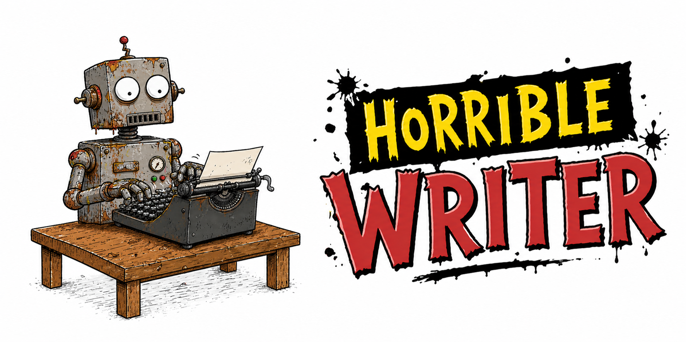

# Horrible Writer

Feed it dull, complicated science, and it will turn it into something weirdly fun.

Scientific writing often has a good reason for being dense: it is carrying methods, caveats, definitions, results, and careful claims all at once. Horrible Writer does not solve that problem by cutting the hard parts away. It keeps the science intact and makes the explanation better, so a reader can follow the same ideas with less friction.

The central question is simple: can a structured scientific text become easier to read without losing its structure, technical depth, or original meaning?

## Inspiration

Horrible Writer is inspired by the *Horrible Science* book series written by Nick Arnold and Phil Gates and illustrated by Tony de Saulles. The series was designed to get children interested in science by focusing on the trivial, unusual, gory, or unpleasant parts of scientific topics, which is exactly the spirit this skill borrows: make science feel alive without making it less scientific.

Learn more: [Horrible Science on Wikipedia](https://en.wikipedia.org/wiki/Horrible_Science).

## What It Does

Horrible Writer rewrites scientific, academic, and technical text so it feels clearer, more intuitive, and more engaging. It preserves every section, every important detail, and the original order of ideas, then adds the missing connective tissue: short explanations, context, transitions, and plain-language clarifications.

Think of it as a careful editor for complicated research prose. It does not turn a paper into a slogan or a summary. It guides the reader through the same material with better signposts.

## What It Preserves

The skill is built around completeness. It keeps section structure exactly, including Abstract, Introduction, Method, Results, Discussion, and Conclusion when those sections appear. It also keeps technical terms such as embeddings, hypernetworks, LoRA, regression models, experimental conditions, measures, parameters, datasets, and limitations.

When a concept is difficult, Horrible Writer explains it instead of deleting it. That means Methods and Experiments sections stay technically meaningful, while becoming easier to follow.

## How It Improves the Writing

Horrible Writer adds an informative hook at the start of the Abstract or Introduction when appropriate, then frames the central idea as a guiding question. It explains technical terms in plain language, uses comparisons only when they help, and adds micro-explanations where a reader might otherwise pause.

The style stays grounded. The goal is not comedy, hype, or oversimplification. The goal is a friendly, readable version of the same science, with better flow and fewer unanswered questions.

## Using the Skill

Invoke the skill as:

```text
Use $horrible-writer to rewrite this scientific text so it is clearer, more engaging, and still complete.
```

Then provide the structured scientific text you want rewritten.

## Repository Contents

- `horrible-writer/SKILL.md`: the agent-facing skill instructions.
- `horrible-writer/agents/openai.yaml`: UI metadata for Codex skill listings.

## Design Principle

Clarity over cleverness. Completeness over brevity. Flow over punchiness.

The reader should finish the text with fewer questions, not fewer ideas.
